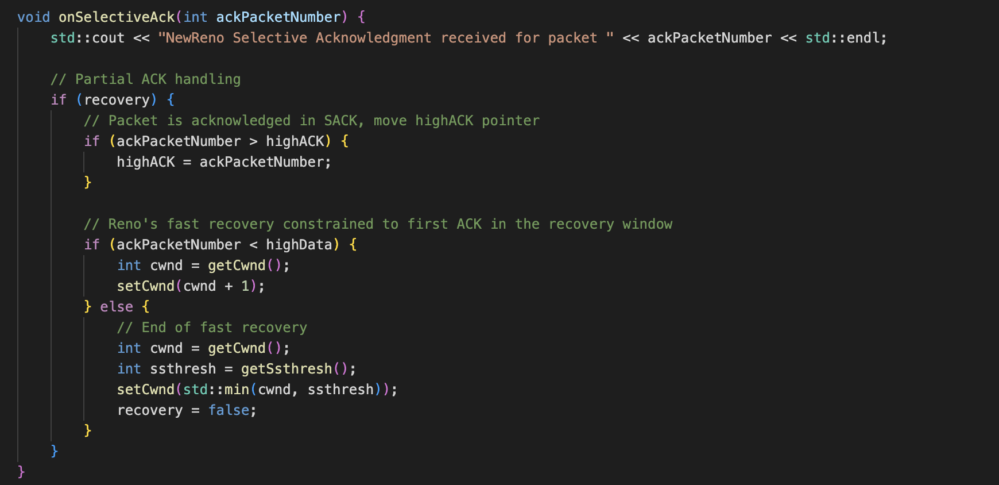

# TCPConnection Class
#### void sendData()

This method is responsible for sending data over the TCP connection.
It retrieves the current congestion window size (cwnd) and the slow start threshold (ssthresh) from the base class using the getCwnd() and getSsthresh() methods.
It prints a message indicating the current value of cwnd.
It checks if the current cwnd is less than ssthresh. If so, it means the TCP connection is in the slow start phase. In that case, it doubles the value of cwnd by multiplying it by 2 using the setCwnd() method.
If the cwnd is not less than ssthresh, it means the TCP connection is in the congestion avoidance phase. In that case, it increments the value of cwnd by 1 using the setCwnd() method.

 

 

#### void onPacketLoss()

This method is called when a packet loss is detected in the TCP connection.
It retrieves the current congestion window size (cwnd) from the base class using the getCwnd() method.
It prints a message indicating the packet loss.
It adjusts the slow start threshold (ssthresh) by setting it to half of the current cwnd using the setSsthresh() method.
It then sets the congestion window size (cwnd) to the sum of the slow start threshold and 3 using the setCwnd() method. This is a specific behavior of the Reno algorithm during the fast recovery phase.

 

 

#### void onRTTUpdate(int newRTT)

This method is called when the round-trip time (RTT) of the TCP connection is updated.
It prints a message indicating the new RTT value.
It updates the RTT value stored in the base class with the provided newRTT value using the setRtt() method.

 

 

# TCPNewReno Class
#### void sendData()

This method is responsible for sending data over the TCP connection.
It retrieves the current congestion window size (cwnd) and the slow start threshold (ssthresh) from the base class using the getCwnd() and getSsthresh() methods.
It prints a message indicating the current value of cwnd.
It checks if the current cwnd is less than ssthresh. If so, it means the TCP connection is in the slow start phase. In that case, it doubles the value of cwnd by multiplying it by 2 using the setCwnd() method.
If the cwnd is not less than ssthresh, it means the TCP connection is in the congestion avoidance phase. In that case, it increments the value of cwnd by 1 using the setCwnd() method.

 

 

#### void onPacketLoss()

This method is called when a packet loss is detected in the TCP connection.
It retrieves the current congestion window size (cwnd) from the base class using the getCwnd() method.
It prints a message indicating the packet loss.
It adjusts the slow start threshold (ssthresh) by setting it to half of the current cwnd using the setSsthresh() method.
It then sets the congestion window size (cwnd) to the sum of the slow start threshold and 3 using the setCwnd() method. This is a specific behavior of the NewReno algorithm during the fast recovery phase.
It sets the recovery variable to true to indicate that the TCP connection is in the recovery phase.
It updates the highData variable with the value of the current cwnd.

 

 

#### void onRTTUpdate(int newRTT)

This method is called when the round-trip time (RTT) of the TCP connection is updated.
It prints a message indicating the new RTT value.
It updates the RTT value stored in the base class with the provided newRTT value using the setRtt() method.

 

 

#### void onSelectiveAck(int ackPacketNumber)

This method is called when a selective acknowledgment (SACK) is received for a packet in the TCP connection.
It prints a message indicating the received SACK packet number.
It performs partial acknowledgment handling when the TCP connection is in the recovery phase (recovery is true).
If the received ACK packet number is greater than the current highACK, it updates the highACK variable with the received ACK packet number.
If the received ACK packet number is less than the highData, it means the ACK acknowledges a packet within the recovery window. In that case, it increments the congestion window size (cwnd) by 1 using the setCwnd() method. This follows the NewReno's fast recovery behavior.
If the received ACK packet number is equal to or greater than highData, it means the fast recovery phase has ended. In that case, it retrieves the current cwnd and ssthresh values, and sets the cwnd to the minimum of the two values using the setCwnd() method. It also sets the recovery variable to false.

 

 

# BBR Class
#### void updateMaxBandwidth(int bandwidth)

This method is responsible for updating the maximum bandwidth value in the BBR algorithm.
It takes a parameter bandwidth, representing the measured bandwidth.
If the provided bandwidth is greater than the current max_bandwidth, it updates the max_bandwidth variable with the new value.

 

 

#### void updateMinRtt(int rtt)

This method is responsible for updating the minimum round-trip time (RTT) value in the BBR algorithm.
It takes a parameter rtt, representing the measured round-trip time.
If the provided rtt is less than the current min_rtt, it updates the min_rtt variable with the new value.

 

 

#### void sendData()

This method is responsible for sending data over the TCP connection using the BBR algorithm.
It retrieves the current congestion window size (cwnd) and the slow start threshold (ssthresh) from the base class using the getCwnd() and getSsthresh() methods.
It prints a message indicating the current value of cwnd.
The BBR algorithm sends data at a rate determined by the max_bandwidth and adjusts the sending rate based on the min_rtt.
It calculates a new cwnd value by taking the minimum between doubling the current cwnd and multiplying the max_bandwidth by the min_rtt.
It sets the congestion window size (cwnd) to the calculated value using the setCwnd() method.

 

 

#### void onPacketLoss()

This method is called when a packet loss is detected in the TCP connection.
It prints a message indicating the packet loss.
In the BBR algorithm, instead of immediately adjusting the congestion window (cwnd) and slow start threshold (ssthresh), it focuses on monitoring network conditions for a longer term.
It updates the max_bandwidth by dividing the current cwnd by the round-trip time (rtt) using the updateMaxBandwidth() method.
It updates the min_rtt by setting it to the current round-trip time (rtt) using the updateMinRtt() method.

 

 

#### void onRTTUpdate(int newRTT)

This method is called when the round-trip time (RTT) is updated in the TCP connection.
It sets the round-trip time (rtt) to the provided newRTT using the setRtt() method.
If the provided newRTT is less than the current min_rtt, it updates the min_rtt variable with the new value.

 

 

# Main

It declares two arrays, packetLossRates and RTTs, which represent different percentages of packet loss rates and RTTs in milliseconds, respectively.

The code enters a loop that iterates over each RTT value in the RTTs array.

Inside the loop, three instances of the congestion control algorithm classes (TCPReno, TCPNewReno, and BBR) are instantiated with initial congestion window (cwnd) and slow start threshold (ssthresh) values of 10 and 100, respectively.

The current RTT value is used inside the loop, and it is printed to the console.

The onRTTUpdate() method is called for each congestion control algorithm instance, passing the current RTT value as an argument. This updates the RTT value within each algorithm.

Another loop is executed 20 times, representing the simulation of data transfer and packet loss events within the network.

Inside this loop, if the iteration number is a multiple of 10 (i.e., i % 10 == 0), it simulates a packet loss event by calling the onPacketLoss() method for each congestion control algorithm instance.

If the iteration number is not a multiple of 10, it simulates sending data by calling the sendData() method for each congestion control algorithm instance.

After the inner loop finishes, a separator line is printed to the console for visual clarity.

The performance statistics of each congestion control algorithm are printed to the console using the print() method for each algorithm instance.

Another separator line is printed to separate the statistics for different RTT values.

The loop continues with the next RTT value until all RTTs in the RTTs array are processed.

Finally, the main() function returns 0, indicating successful program execution.

 

 

# Questions
#### • تفاوت‌ کنترل‌ ازدحام‌ و‌ کنترل‌ جریان‌ را‌ صورت‌ خالصه‌ بیان‌ کنید‌:

کنترل ازدحام (Congestion Control):

هدف: جلوگیری از ازدحام شبکه و کنترل ترافیک در شرایط بار زیاد.
عملکرد: کنترل ازدحام در تلاش است تا نرخ ارسال داده‌ها به شبکه را با توجه به وضعیت شبکه و سرعت جریان داده‌ها کنترل کند.
روش‌ها: از جمله روش‌های کنترل ازدحام می‌توان به Slow Start، Congestion Avoidance، Fast Recovery و Fast Retransmit اشاره کرد.

کنترل جریان (Flow Control):

هدف: محافظت از گیرنده در برابر فرستنده‌ای که با سرعت بیش از حد ارسال می‌کند.
عملکرد: کنترل جریان تلاش می‌کند تا نرخ ارسال داده‌ها توسط فرستنده را مطابق با ظرفیت گیرنده و توانایی پردازشی آن کنترل کند.
روش‌ها: از جمله روش‌های کنترل جریان می‌توان به تکنیک‌های پیش‌بینی ACK، تعیین پنجره لغزشی و استفاده از تایمرها برای تنظیم نرخ ارسال اشاره کرد.
در کل، کنترل ازدحام بر روی سطح شبکه به منظور جلوگیری از ازدحام درون شبکه و تنظیم ترافیک داده‌ها تمرکز دارد، در حالی که کنترل جریان بر روی سطح انتقال داده‌ها بین فرستنده و گیرنده فعالیت می‌کند تا با توجه به قدرت پردازشی گیرنده، نرخ ارسال داده‌ها را کنترل کند.

 

#### • الگوریتم‌ Reno New را‌ به‌ صورت‌ خالصه‌ شرح‌ دهید.

الگوریتم Reno-New نیز همانند Reno، دو فاز اصلی در کنترل ازدحام دارد: Slow Start و Congestion Avoidance.

Slow Start:

در ابتدا، مقدار cwnd (پنجره تعداد بسته‌های ارسالی) برابر با 1 است.
هربار که یک بسته ACK دریافت می‌شود، cwnd به دو برابر مقدار قبلی خود افزایش می‌یابد (ازدیاد خطی).
این فاز ادامه می‌یابد تا cwnd بزرگتر از مقدار ssthresh (حداکثر مقدار پنجره در Slow Start) شود.

Congestion Avoidance:

پس از رسیدن cwnd به ssthresh، الگوریتم وارد فاز Congestion Avoidance می‌شود.
در این فاز، cwnd به صورت خطی (به اندازه 1 در هر دوره RTT) افزایش می‌یابد.
هربار که یک بسته ACK دریافت می‌شود، cwnd به اندازه 1 افزایش می‌یابد.
اگر بروز ازدحام شود (مانند دریافت سریع سه بسته ACK پشت سر هم)، الگوریتم وارد فاز Fast Recovery می‌شود.

Fast Recovery:

هنگامی که بسته ACK تأییدی دریافت می‌شود، cwnd به صورت خطی افزایش می‌یابد (به اندازه 1 در هر بسته ACK).
ssthresh نیز به نصف مقدار فعلی cwnd تنظیم می‌شود.
الگوریتم در این فاز تلاش می‌کند تا جبران سریع ازدحام را انجام دهد و بدون رفتن به Slow Start به Congestion Avoidance برگردد.
این خلاصه‌ای از الگوریتم Reno-New بهبود یافته Reno است و به طور خلاصه نحوه عملکرد و اصول اصلی آن را شرح داد. البته جزئیات و تفصیلات بیشتر در مورد الگوریتم‌های کنترل ازدحام ممکن است وجود داشته باشد که در این خلاصه آورده نشده است.

 

#### • الگوریتم‌ BBR را‌ به‌ صورت‌ خالصه‌ شرح‌ دهید‌.

الگوریتم BBR به جای استفاده از معیارهای کلاسیک مانند cwnd و ssthresh، از دو معیار اصلی یعنی max_bandwidth (حداکثر پهنای باند) و min_rtt (حداقل زمان واکنش) استفاده می‌کند.
در ابتدا، مقدار cwnd برابر با 1 است و مقدار max_bandwidth برابر با مقدار ssthresh قرار می‌گیرد و min_rtt بی‌نهایت (یا یک مقدار بزرگ) قرار داده می‌شود.
الگوریتم در هر دوره RTT از مقدار max_bandwidth و min_rtt برای محاسبه پهنای باند و زمان واکنش استفاده می‌کند.
الگوریتم با استفاده از این اطلاعات، مقدار cwnd را با توجه به حداکثر پهنای باند ممکن و حداقل زمان واکنش بهینه می‌کند.
در صورت بروز ازدحام، الگوریتم از طریق بروزرسانی max_bandwidth و min_rtt به شکل پویا و هوشمند بازتوانایی ازدحام را اندازه‌گیری و تنظیم می‌کند.
در هر دوره RTT، الگوریتم BBR تلاش می‌کند تا میزان ترافیکی که به شبکه ارسال می‌شود را با توجه به پهنای باند بطن و زمان واکنش کمینه تنظیم کند.
الگوریتم BBR با ترکیب این دو معیار و انجام تنظیمات هوشمندانه می‌تواند ترافیک را بسیار بهینه و با کمترین تأخیر و ازدحام در شبکه TCP ارسال کند.

 

####  • تفاوت‌ این سه‌ الگوریتم را‌ به‌ صورت‌ خالصه‌ بیان کنید‌.‌

Reno:

الگوریتم Reno از الگوریتم پایه TCP است که در بسیاری از پیاده‌سازی‌های TCP استفاده می‌شود.
در فاز Slow Start از سرعت رشد خطی برای اندازه پنجره پیشرفت استفاده می‌کند.
در فاز Congestion Avoidance اندازه پنجره پیشرفت را با یک واحد در هر دوره افزایش می‌دهد.
در صورت بروز ازدحام، الگوریتم Reno از روش تشخیص ازدحام تأخیر مبتنی بر تأخیر راندمان (RTT) استفاده می‌کند و پنجره پیشرفت را به نصف کاهش می‌دهد.

New Reno:

الگوریتم New Reno یک توسعه بهبود یافته از الگوریتم Reno است که مشکل ترکیب ازدحام را برطرف می‌کند.
در صورت بروز ازدحام، الگوریتم New Reno از روش Fast Recovery برای ادامه انتقال داده‌ها با اطمینان استفاده می‌کند.
در این روش، پنجره پیشرفت در صورت دریافت یک تأیید جزئی ACK از سمت گیرنده افزایش می‌یابد و در صورت دریافت تأیید کامل ACK به حداکثر اندازه پنجره کاهش پیدا می‌کند.

BBR:

الگوریتم BBR یک الگوریتم کنترل ازدحام پیشرفته است که برای بهبود کارایی شبکه TCP تلاش می‌کند.
این الگوریتم با استفاده از دو پارامتر کلیدی، یعنی حداکثر پهنای باند بطن و زمان واکنش کمینه، ترافیک را بهینه می‌کند.
BBR از معیارهای مبتنی بر تأخیر واقعی و پهنای باند واقعی برای کنترل ازدحام استفاده می‌کند.
این الگوریتم بهبود قابل توجهی در کارایی و کیفیت شبکه TCP در شبکه‌های پرلاگ تجربه کرده است.
بنابراین، هرکدام از این الگوریتم‌ها رویکردها و روش‌های متفاوتی را برای کنترل ازدحام و بهبود عملکرد شبکه TCP ارائه می‌دهند. انتخاب بهترین الگوریتم برای هر محیط و شرایط شبکه وابسته به نیازها و محدودیت‌های مشخصه هر شبکه است.

 

#### • تعدادی‌ از‌ الگوریتم‌ های‌ کنترل‌ ازدحام‌ را‌ که‌ در‌ این‌ تمرین‌ به‌ آنها‌ اشاره ای‌ نشده‌ به‌ صورت‌ مختصر‌ بررسی‌ کنید‌؛‌ یکی‌ از‌ این‌  الگوریتم‌ ها‌ را‌ که‌ از‌ نظر‌ شما‌ حداقل‌ در‌ یک‌ معیار‌ بر‌ الگوریتم‌ های‌ Reno‌ ،Reno New‌ و‌BBR‌ برتری‌ دارد‌ را‌ نام‌ ببرید‌ و‌ دلیل‌ خود‌ را‌ توجیه کنید.

الگوریتم Cubic:

الگوریتم Cubic یک الگوریتم کنترل ازدحام است که در کرنل لینوکس استفاده می‌شود.
این الگوریتم بر مبنای تغییرات تابع مکعبی محاسبه‌شده از ویندو شباهت دارد و تلاش می‌کند نرخ انتقال داده را بهینه‌سازی کند.
Cubic تلاش می‌کند تا با استفاده از تصویر کلی شبکه و پیش‌بینی آینده، ویندو را تنظیم کند و در نتیجه بهبودی در کارایی شبکه ایجاد کند.
این الگوریتم از نظر کنترل ازدحام و بهینه‌سازی نرخ، برتری نسبت به Reno، Reno New و BBR دارد.
دلیل: Cubic با استفاده از تغییرات تابع مکعبی، توانایی بهتری در تطبیق با شبکه و کنترل ازدحام دارد و می‌تواند با دقت بیشتری نرخ انتقال داده را تنظیم کند.

الگوریتم Westwood:

الگوریتم Westwood نیز یک الگوریتم کنترل ازدحام است که بر اساس الگوریتم Reno توسعه یافته است.
این الگوریتم با بهبود کارایی در شبکه‌های با تاخیر بالا و اتصالات بی‌سیم، تلاش می‌کند به نرخ انتقال داده بهینه دست یابد.
Westwood از روش‌های مختلفی برای پنجره پنجره استفاده می‌کند و بهبودی در کنترل ازدحام و کاهش تاخیر میانگین را ارائه می‌دهد.
این الگوریتم از نظر کارایی شبکه و کنترل ازدحام برتری نسبت به Reno، Reno New و BBR دارد.
دلیل: Westwood با استفاده از روش‌های پیشرفته برای پنجره پنجره، توانایی بهتری در تطبیق با وضعیت شبکه و بهینه‌سازی نرخ دارد، به خصوص در شبکه‌های با تاخیر بالا و اتصالات بی‌سیم.

 